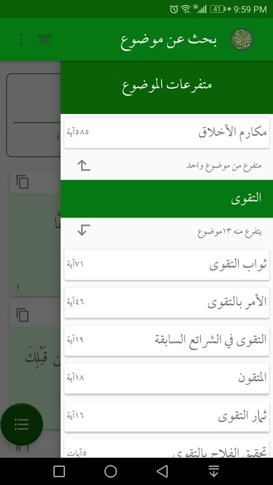

# Project Name
- Mafateeh-AlQuran-ALkareem - Search Engine for the Holy Quran based 
- Arabic: مفاتيح القرآن الكريم - محرك بحث موضوعي للقرآن الكريم  

# Description
This distinguished Quranic App is capable of searching the Holy Quran for a specific topic even if the title of the topic is not found as a word inside the Quranic text. For more information about this idea please check the following slides @ https://www.slideshare.net/ssuser12a683/ss-167940618?qid=bc3b15bb-28df-45b6-a920-a4b717101a9a&v=&b=&from_search=1 

# Features
- A large number of Quranic topics available for research (more than 6,000 topics).
- Great ease in the search for a specific Qur'anic topic.
- Accurate division in Quranic topics.
- Display the meanings of the Quranic vocabulary from several linguistic dictionaries.
- Numerical statistics and graphs for search results.
- Arrange the verses on the results page alphabetically or by Makki and Civil.
- Search service for matching word.
- Simple to use.
- Constant updating of emerging Quranic topics.
- Explanation of verses from several interpretations.
- Free and without internal ads.
- ... and many other features that are still under development.

#### Try some of these features @ www.moslim.com
#### For full features download the app from https://play.google.com/store/apps/details?id=com.quran.subjects.app&hl=en

# Contributing
- Since this app is an open source project, it's easy for anyone to contribute and help improve the project. 
- We are open to hear your suggestions, and your valuable contributions are highly appreciated.
- Please open an issue first to discuss what you would like to change before beginning implementation.
- For developers: You can  and check it out.
- Currently, the database is still private, we will not share complete dump. A mini version is ready for contributing.
- May Allah reward all the awesome Contributors...

# Acknowledgment
We would like to acknowledge the help of all the people involved in this project whom, without their support, this project would not have become a reality.

# License
- This project is distributed under the Apache license version 2.0 (see the LICENSE file in the project root).
- By submitting a pull request to this project, you agree to license your contribution under the Apache license version 2.0 to this project.

# Screenshots

